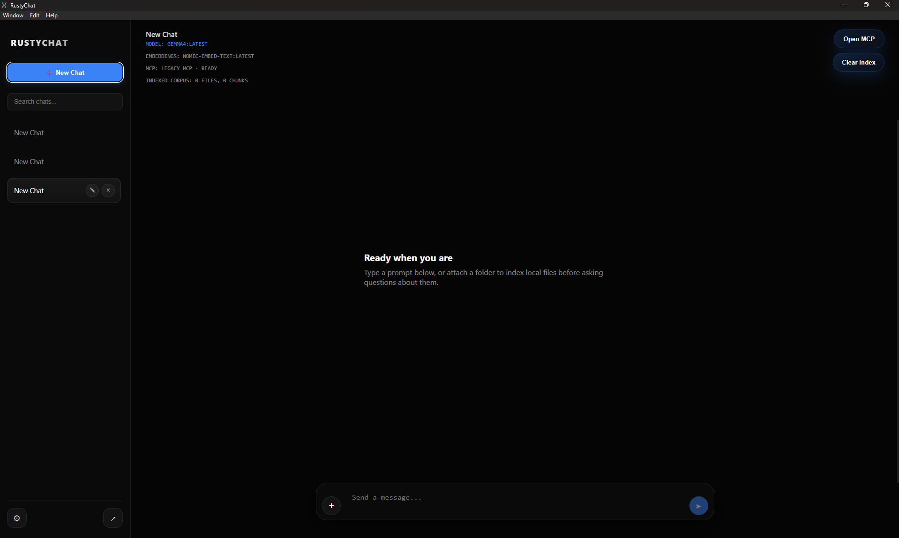
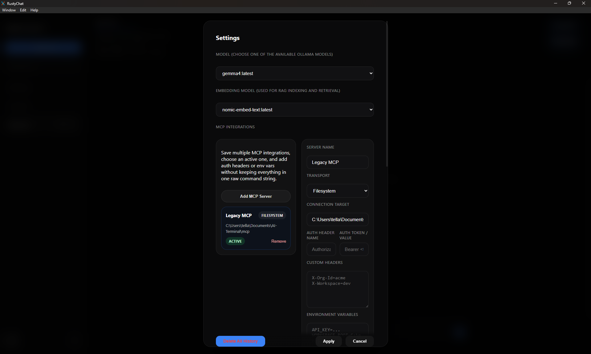
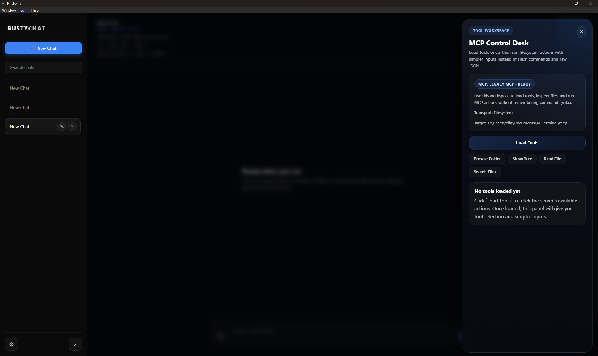

# RustyChat

RustyChat is a local-first desktop AI workspace built with Rust and Dioxus. It combines Ollama chat, vision-capable prompts, local RAG, inline code execution, and MCP integrations in a single desktop app with SQLite-backed persistence.

This repository is the actively maintained continuation of the original RustyChat project by `KPCOFGS`. The original upstream was archived, so ongoing development continues here with attribution preserved.

## What It Does

- Chats with local Ollama models through `/api/chat`
- Supports file, image, and folder attachments directly in chat
- Passes attached images to vision-capable Ollama models
- Indexes local folders with Ollama embeddings for RAG-style context injection
- Runs generated Python, JavaScript, Bash, and PowerShell snippets with opt-in execution controls
- Connects to MCP servers over `filesystem`, `stdio`, and `http`
- Stores chats, settings, RAG chunks, and app error logs in local SQLite

## Current Feature Set

- Modular architecture split across `db`, `ui`, `ollama`, `rag`, `executor`, and `mcp`
- Searchable sidebar with persistent chats and rename/delete controls
- Rich markdown rendering with code block copy/run actions
- Shared in-app toast notifications for success, warning, and error states
- Multi-server MCP configuration with active switching, auth headers, custom headers, and env vars
- Tool-friendly MCP result cards for common filesystem outputs
- DB-backed long-history loading so large chats do not all render at once
- Global zoom control and responsive desktop layout

## Requirements

- Rust
- Cargo
- Ollama running locally
- At least one Ollama chat model installed

Optional:

- An embedding-capable Ollama model for RAG
- MCP servers or folders/endpoints you want to connect to

RustyChat expects Ollama at:

- `http://localhost:11434`

You can verify that with:

```bash
curl http://localhost:11434/api/tags
```

## Build And Run

1. Clone the repository

```bash
git clone https://github.com/KPCOFGS/RustyChat.git
cd RustyChat
```

2. Run the app in development

```bash
cargo run
```

3. Or build a release binary

```bash
dx build --release
```

## How Persistence Works

- Chats are stored in the `chats` table
- Messages are stored in the `messages` table
- App settings are stored in the `settings` table
- Indexed RAG chunks are stored in the `document_chunks` table
- App-level error logs are stored in the `app_logs` table

The app uses a local `chat.db` SQLite database in the runtime working directory.

## MCP Integrations

RustyChat supports three MCP connection styles:

- `Filesystem`: point at a local folder and launch the filesystem MCP server for it
- `StdIO`: launch a full MCP command directly
- `HTTP`: call an MCP endpoint with optional auth and custom headers

The settings UI lets you save multiple MCP integrations, switch the active integration, and use the MCP Control Desk to load tools and run calls without memorizing raw command syntax.

## Inline Code Execution

Inline execution is disabled by default. When enabled in Settings, RustyChat:

- Runs supported snippets in a temp working directory
- Applies a configurable timeout
- Caps captured output to keep the UI responsive

This is a safer execution boundary, not a full sandbox.

## Screenshots

Main workspace



MCP integration settings



MCP Control Desk



## License

This project is licensed under the MIT License. See [LICENSE](./LICENSE) for details.
